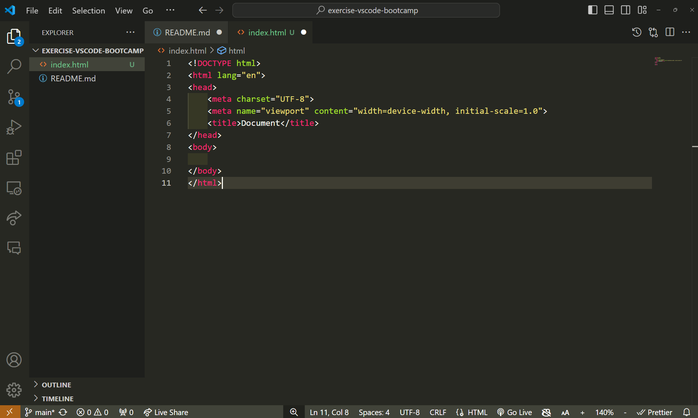
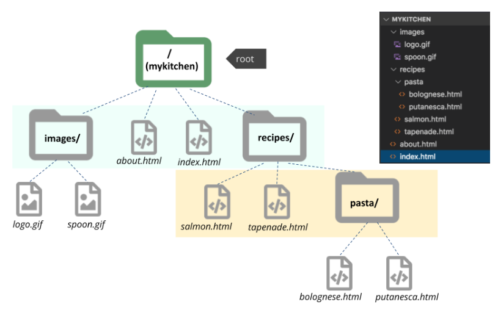

# Visual Studio Code Bootcamp

I detta dokument hittar du övningar som är avsedda att hjälpa dig att komma igång med användningen av en kodeditor. Den mest populära kodeditorn som används idag är Visual Studio Code (VS Code), och därför kommer vi att använda den som standardverktyg under din utbildning. Men om du föredrar att använda en annan kodeditor är det naturligtvis helt upp till dig.
Om du inte redan har laddat hem Visual Studio Code, så kan du göra det [här](https://code.visualstudio.com/download).

## Mappstruktur

Här är ett förslag på hur du kan organisera dina filer i mappar på datorn.
För varje uppgift skapar du en ny mapp. Då blir det lätt att hitta tillbaka till tidigare uppgifter.

```
/skola
    /kursnamn
        /uppgift
            index.html osv....
```

Använd gärna löpnummer, skriv på engelska, alltid småbokstäver och utan mellanslag, så kommer du få en bättre struktur som är lättare att hitta i. Exempel "01-exercise-vscode".

## Uppgifter

### Lär känna VS Code

1. Skapa en ny mapp på datorn och öppna den med VS Code.
2. Skapa en ny fil, byt namn på filen, ta bort filen.
3. Indentera en eller flera rader, se om du kan ändra indenteringen mellan 2 och 4 mellanslag.
4. Öppna inställningarna.
5. Visa *Command Pallette*.
6. Installera valfri extension. 
7. Visa två filer samtidigt (split editor).


### Sökvägar



1. Skapa samma filträd som på bilden ovan i VS Code (byt ut gifarna mot egna bilder).
2. Öva på relativa sökvägar, hur länkar du till något...
    * ...i samma katalog?
    * ...inuti en annan katalog?
    * ...två kataloger ner?
    * ...enkatalog upp?
    * ...två kataloger upp?
3. Koppla ihop alla dina filer så att man kan hoppa mellan dem på ett rimligt sätt. Tips! ```<a href=""></a>``` är elementet du behöver använda. Från startsidan bör man kunna ta sig till *about.html*, samt alla receptsidor. Alla individuella sidor bör dessutom kunna leda användaren tillbaks till startsidan.
4. Levelup! Länka in en av dina bilder i filen *salmon.html*, och den andra i *putanesca.html*. Tips! För att länka in bilder behöver du använda ``````.